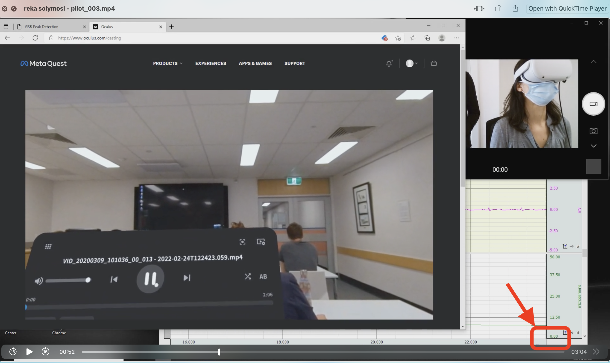

```{r setup, include=FALSE}
knitr::opts_chunk$set(echo = TRUE)

library(dplyr)
library(ggplot2)
```

# Two software platforms

We are testing two approaches to recording, one is to record everything in the imotions software and the other one is to use Acqknowledge software, and a separate screen capture and webcam to record the videos. 


# iMotions

The iMotions software has screen capture, video, heart rate and GSR in the same platform. To synchronise the video, we can add a marker for when the recording begins to play within the iMotions software, and this is exported with the data export.


## Import the data

To read in data from iMotions, we can use `read.csv()` and carry out basic cleaning: 

```{r}

# import data with read.csv()
imotions_data <- read.csv("../../data/olga/reka solymosi - 001_pilot_003_imotions.csv")

# set column names and remove noisy header
names(imotions_data) <- imotions_data[27,]
imotions_data <- imotions_data[28:nrow(imotions_data),]

imotions_data <- janitor::clean_names(imotions_data)

```


The following columns are of interest: 

- Timestamp is the timestamp
- The column Channel 10 (ECG100C) is the raw heart date
- The column Channel 9 (EDA100C) is the raw GSR
- "Heart_Rate" is calculated HR
- "GSR Raw (microSiemens)"
- "GSR Interpolated (microSiemens)(GSRPEAK=IsPeak)(GSRONSET=GsrOnset)(GSROFFSET=GsrOffset)"
- "Peak detected (binary)"                                                                 
- "Peak amplitude (microSiemens)"                                                          
- "Peak times"                                                                             
- "Signal interpolation (binary)" 
- "video play active" and "video play instance" : these indicate when the video was playing. NOTE: end is not indicated, this must be calculated.


## Calculate end of video

To calculate the end of video we take the time stamp of the start of the video, and we add the duration (acquired with *exiftool*). 

**Info: **

- Duration: 0:02:06
- Preview Duration: 0 s
- Selection Duration: 0 s
- Track Duration: 0:02:06
- Media Duration: 0:02:06


```{r}

video_start <- imotions_data %>% 
  filter(video_play_active == "video play") %>% 
  pull(timestamp) %>% as.numeric() %>% min()
video_end <- video_start + 126000

imotions_data <- imotions_data %>% 
  mutate(timestamp_num = as.numeric(timestamp), 
         video_start_end = case_when(timestamp_num == video_start ~ "START", 
                                     timestamp_num > video_start & 
                                      timestamp_num < video_end ~ "DURING",
                                     TRUE ~ NA_character_))


video_end_link <- imotions_data %>% 
  filter(video_start_end == "DURING") %>% pull(timestamp) %>% 
  as.numeric() %>% max(na.rm = TRUE)

imotions_data <- imotions_data %>% 
  mutate(video_start_end = ifelse(timestamp_num == video_end_link + 1, 
                                  "END", video_start_end))
  
  
```


## Visualise to check how it looks


```{r}

imotions_data <- imotions_data %>% 
  mutate(channel_9_ecg100c = as.numeric(channel_9_ecg100c))

ggplot() + 
  geom_line(data = imotions_data %>% filter(!is.na(channel_9_ecg100c)), 
            aes(x = timestamp_num, y = channel_9_ecg100c)) + 
  geom_vline(xintercept = imotions_data %>% 
               filter(video_start_end == "START") 
             %>% pull(timestamp_num),
             col = "orange", lwd = 1, lty = 12) + 
  geom_label(aes(x = imotions_data %>% 
                   filter(video_start_end == "START") %>% 
                   pull(timestamp_num), 
                y = 0.5, label = "Video Start"), col = "orange") +  
  geom_vline(xintercept = imotions_data %>% 
               filter(video_start_end == "END") %>% 
               pull(timestamp_num), 
             col = "purple", lwd = 1, lty = 12) + 
  geom_label(aes(x = imotions_data %>% 
                   filter(video_start_end == "END") %>% 
                   pull(timestamp_num), 
                y = 0.5, label = "Video End"), col = "purple") + 
  theme_minimal() + 
  labs(title = "Raw ECG with video start and end times") + 
  xlab("timestamp") + 
  ylab("ECG")


```

That looks about right. Now we can do the same thing to introduce the segments of the video which we're interested in. 


# Acqknowledge

The Acqknowledge software records the GSR and heart rate, and also offers calibration for the GSR, which the iMotions does not do. However there is no screen or video recording, so we have to use VLC media player and a webcam app to record the screen and video. THere are also no calculated columns, only the raw ECG and EDA outputs with timestamp. 

## Import the data

To read in data from Acqknowledge, we can use `read.csv()` and carry out basic cleaning: 

```{r}

acqk_data <- read.table("../../data/olga/reka solymosi - pilot_003_acq.txt", sep = "\t", skip = 9)
names(acqk_data) <- c("timestamp", "ECG", "EDA", "video_start_end")


```


## Calculate start and end of video

To calibrate, we bring into view the acquknowledge window and the video, and note the time in which the video begins to play. This time needs to be noted manually, and then manually added to the data. Below image illustrates the manual recording: 




In the above example, the video begins playing when Acqknowledge timestamp is around 23.6 seconds. This needs to be noted and added to the data manually. 


First we need the sample rate and the units for the timestamp which is found in line 2 and 8 of the text file: 

```{r}

sample <- read.table("../../data/olga/reka solymosi - pilot_003_acq.txt", sep = "\t", nrows = 2)[2,1]
sample

units <- read.table("../../data/olga/reka solymosi - pilot_003_acq.txt", sep = "\t", nrows = 8)[8,1]
units

```


We see we have `r sample` sampling rate and the units are in `r units`. 

```{r}

start_time <- 23.6/60
end_time <- start_time + 2.1

# find closest value to start and end times in the timestamp vector

start_time_closest <- which.min(abs(acqk_data$timestamp - start_time))

end_time_closest <- which.min(abs(acqk_data$timestamp - end_time))


```

This seems to be the `r start_time_closest`th sample which is: `r acqk_data$timestamp[start_time_closest]`. So we can use this to pin the "START" marker:

```{r}

acqk_data$video_start_end <- NA
acqk_data$video_start_end[start_time_closest] <- "START"

```


Do the same for the end time `r end_time_closest` th sample which is: `r acqk_data$timestamp[end_time_closest]`. So we can use this to pin the "END" marker:


```{r}

acqk_data$video_start_end[end_time_closest] <- "END"

```


Now visualise this one too: 

```{r}

ggplot() + 
  geom_line(data = acqk_data %>% filter(!is.na(ECG)), 
            aes(x = timestamp, y = ECG)) + 
  geom_vline(xintercept = acqk_data %>% 
               filter(video_start_end == "START") 
             %>% pull(timestamp),
             col = "orange", lwd = 1, lty = 12) + 
  geom_label(aes(x = acqk_data %>% 
                   filter(video_start_end == "START") %>% 
                   pull(timestamp), 
                y = 0.5, label = "Video Start"), col = "orange") +  
  geom_vline(xintercept = acqk_data %>% 
               filter(video_start_end == "END") %>% 
               pull(timestamp), 
             col = "purple", lwd = 1, lty = 12) + 
  geom_label(aes(x = acqk_data %>% 
                   filter(video_start_end == "END") %>% 
                   pull(timestamp), 
                y = 0.5, label = "Video End"), col = "purple") + 
  theme_minimal() + 
  labs(title = "Raw ECG with video start and end times")


```


# For analysis

To analyse we can divide the video into three phases: 

- 1) intro: 00:00 - 00:48
- 2) staring 00:48 - 01:36
- 3) intervention (none, indirect, or direct, depending on the video) 01:31 - 02:06


## Create break points

```{r}


staring_start_time <- start_time + 0.8
staring_start_time_closest <- which.min(abs(acqk_data$timestamp - staring_start_time))

intervention_start_time <- start_time + 1.5
intervention_start_time_closest <- which.min(abs(acqk_data$timestamp - intervention_start_time))

acqk_data$video_start_end[staring_start_time_closest] <- "STARING STARTS"
acqk_data$video_start_end[intervention_start_time_closest] <- "INTERVENTION STARTS"

table(acqk_data$video_start_end)
```


## Plot


```{r}

ggplot() + 
  geom_line(data = acqk_data %>% filter(!is.na(ECG)), 
            aes(x = timestamp, y = ECG)) + 
  geom_vline(xintercept = acqk_data %>% 
               filter(video_start_end == "START") 
             %>% pull(timestamp),
             col = "orange", lwd = 1, lty = 12) + 
  geom_label(aes(x = acqk_data %>% 
                   filter(video_start_end == "START") %>% 
                   pull(timestamp), 
                y = 0.5, label = "Video Start"), col = "orange") +  
  geom_vline(xintercept = acqk_data %>% 
               filter(video_start_end == "END") %>% 
               pull(timestamp), 
             col = "purple", lwd = 1, lty = 12) + 
  geom_label(aes(x = acqk_data %>% 
                   filter(video_start_end == "END") %>% 
                   pull(timestamp), 
                y = 0.5, label = "Video End"), col = "purple") + 
  geom_vline(xintercept = acqk_data %>% 
               filter(video_start_end == "STARING STARTS") %>% 
               pull(timestamp), 
             col = "pink", lwd = 1, lty = 12) + 
  geom_label(aes(x = acqk_data %>% 
                   filter(video_start_end == "STARING STARTS") %>% 
                   pull(timestamp), 
                y = 0.5, label = "Staring starts"), col = "pink") + 
  geom_vline(xintercept = acqk_data %>% 
               filter(video_start_end == "INTERVENTION STARTS") %>% 
               pull(timestamp), 
             col = "green", lwd = 1, lty = 12) + 
  geom_label(aes(x = acqk_data %>% 
                   filter(video_start_end == "INTERVENTION STARTS") %>% 
                   pull(timestamp), 
                y = 0.5, label = "Intervention starts"), col = "green") + 
  theme_minimal() + 
  labs(title = "Raw ECG with video stages")


```


